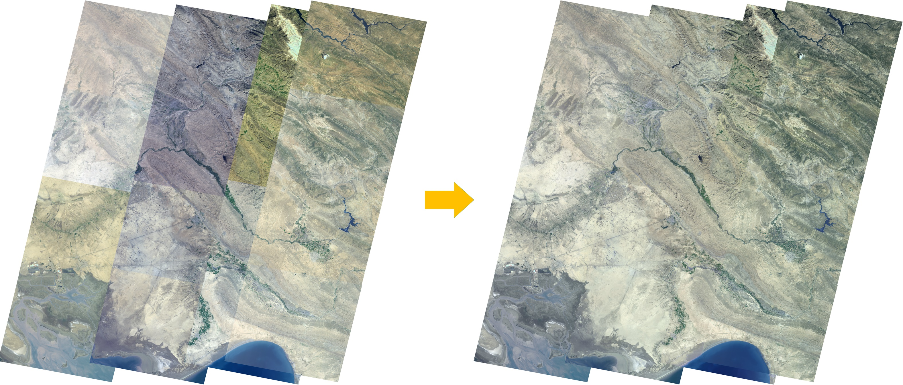

## Introduction

This project is developed for optimizing the color consistency across images and guarantee the imaging
quality of individual image meanwhile. we parameterize the color remapping curve as transform model, 
and express the constraints of color consistency, contrast and gradient in an uniform energy function. It 
can be formulated as a convex quadratic programming problem which provides the global optimal solution efficiently.

This C++ implemented algorithm is described in:  
"[Color Consistency Correction Based on Remapping Optimization for Image Stitching](http://menghanxia.github.io/papers/2017_Color_Remapping_Optimization_iccvw.pdf)", ICCV Workshop 2017.  
"[A Closed-Form Solution for Multi-View Color Correction with Gradient Preservation](http://menghanxia.github.io/papers/2019_Color_Consistency_Optimization_isprs_journal.pdf)", ISPRS Journal 2019 (Extended version).  
This program is free for personal, non-profit and academic use. If you have any question, please contact: menghanxyz@gmail.com (Menghan Xia)

Here is an example for demonstration below:



## Usage
### 1. Dependent Libarary [compulsory]:
OpenCV 2.4.9 is recommended.

### 2. Project Configure:
This procedure is developed on *Visual Studio 2010* under *Windows8.1* system environment,
where the source code is organized with CMakeLists. So, before opening it in Visual Studio,
you need to configure the project with the software named *CMake*.

### 3. Input Data Structure
``` bash
.
├── 00000
│   ├── 0.jpg
│   ├── 1.jpg
│   └──  ...
├── 00001
│   ├── 0.jpg
│   ├── 1.jpg
│   └──  ...
├── 00002
│   ├── 0.jpg
│   ├── 1.jpg
│   └──  ...
└── ...
```

### 4. Output Data Structure
``` bash
.
├── 00000
│   ├── 0.jpg
│   ├── 1.jpg
│   └──  ...
├── 00001
│   ├── 0.jpg
│   ├── 1.jpg
│   └──  ...
├── 00002
│   ├── 0.jpg
│   ├── 1.jpg
│   └──  ...
└── ...
```

### 5. Running and Test:
input folder: ./Release/input/[yourcase]:
```bash
Unification.exe [yourcase]
```

output folder
./Release/result/[yourcase]:

## Citation
If any part of our paper and code is helpful to your work, please generously cite with:
```
@inproceedings{XiaYXZX17,
  author    = {Menghan Xia and Jian Yao and Renping Xie and Mi Zhang and Jinsheng Xiao},
  title     = {Color Consistency Correction Based on Remapping Optimization for Image Stitching},
  booktitle = {{IEEE} International Conference on Computer Vision Workshops (ICCVW)},
  year      = {2017}
}
```
